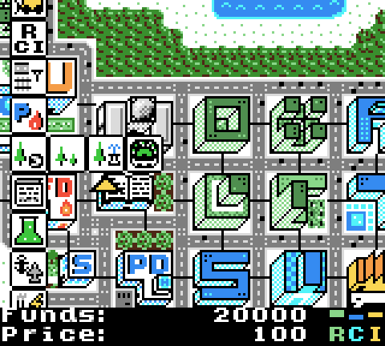

==============
µCity 0.4 beta
==============

The open-source city building game for Game Boy Color.

Introduction
============

This is a beta version of µCity (also spelled 'uCity', pronounced 'micro-city').
Some of the functionality is missing, but most of the game is completed.

It is developed using BGB (http://bgb.bircd.org/), and it's tested on hardware
every once in a while.

This game was previously called BitCity.

NOTE: I'm looking for a good pixel artist to help me with the game graphics. If
you are interested please contact me at my email: antonio_nd at outlook dot com

General to do list:

- Simulation

  - Graphical output (wind power plants?)
  - Adjust simulation parameters

- Sample cities
- Music - Allow to disable it from the options menu
- Improve graphics
- Cleanup code and document
- Game manual

Controls
========

- Start: Open pause menu.
- Select: Open building select menu.
- B: If held, fast scroll.

Credits
=======

Game made by AntonioND/SkyLyrac (Antonio Niño Díaz)

Email:

    antonio_nd@outlook.com / antonionidi@gmail.com

Web:

    https://github.com/AntonioND

    http://antoniond_blog.drunkencoders.com/

    http://antoniond.drunkencoders.com/

Dependencies:

- RGBDS

  It is needed to assemble the code. This is the only real dependency:

      https://github.com/rednex/rgbds/

- GBT Player

  It uses GBT Player, my music player library. It is not needed to install it as
  it comes with the game code, but it can be found here if you want to use it
  for your projects:

      https://github.com/AntonioND/gbt-player

Tools (for Windows, but they run on Wine):

- GBMB (Game Boy Map Builder)

    http://www.devrs.com/gb/hmgd/gbmb.html

- GBTD (Game Boy Tile Designer)

    http://www.devrs.com/gb/hmgd/gbtd.html

Compiling
=========

The Makefile has to be edited to point the RGBDS binaries. Then, open the
console and type :code:`make`. This should work on Linux, MinGW, Cygwin, etc.

License
=======

This game is licensed under the GPL v3 license. You should have received the
source code of this game along with the ROM file. If not, the source code is
freely available at the following address:

    https://github.com/AntonioND/ucity

Not all source code files are licensed under the GPL v3, though, only the ones
with the GPL header are. There other source files are licensed under different
terms (for example, GBT Player is licensed under the 2-clause BSD license).

The media files (graphics and music) are licensed under a Creative Commons
license (CC BY-SA 4.0).

GNU General Public License version 3
====================================

    µCity - City building game for Game Boy Color.
    Copyright (C) 2017 Antonio Niño Díaz (AntonioND/SkyLyrac)

    This program is free software: you can redistribute it and/or modify
    it under the terms of the GNU General Public License as published by
    the Free Software Foundation, either version 3 of the License, or
    (at your option) any later version.

    This program is distributed in the hope that it will be useful,
    but WITHOUT ANY WARRANTY; without even the implied warranty of
    MERCHANTABILITY or FITNESS FOR A PARTICULAR PURPOSE.  See the
    GNU General Public License for more details.

    You should have received a copy of the GNU General Public License
    along with this program.  If not, see <http://www.gnu.org/licenses/>.

    Contact: antonio_nd@outlook.com

